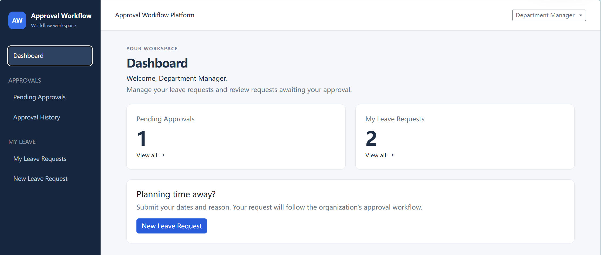
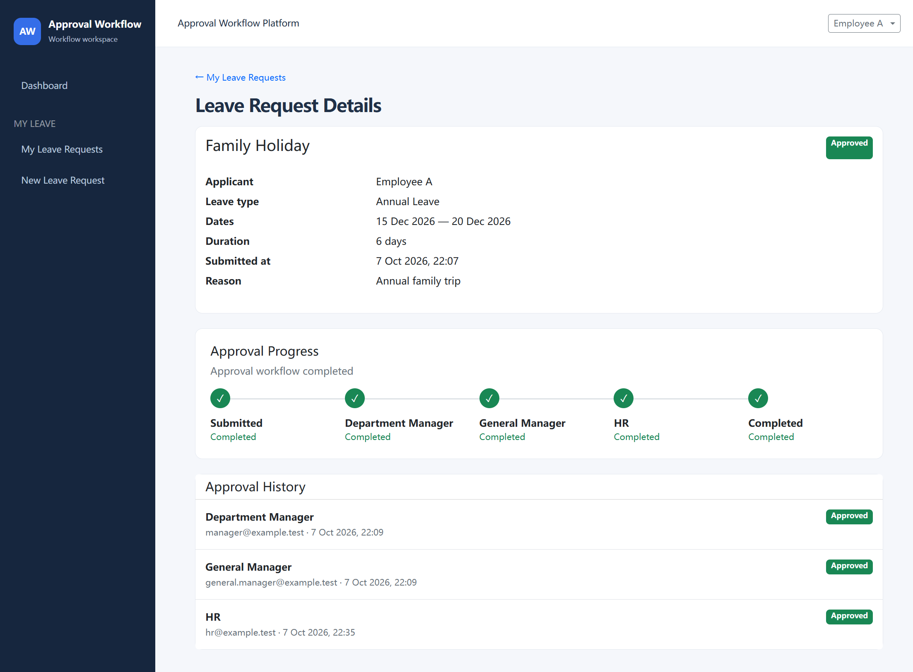
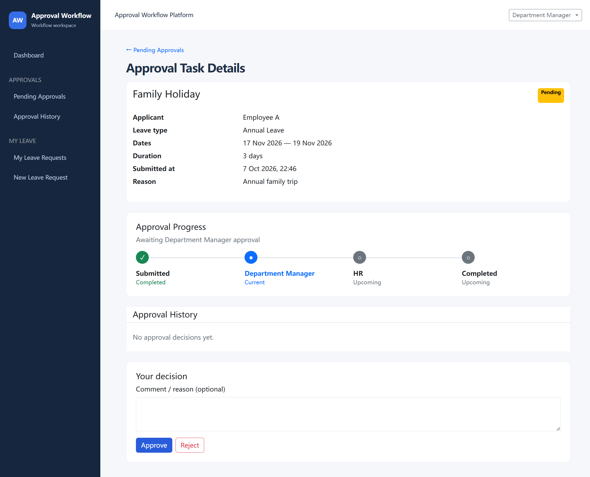
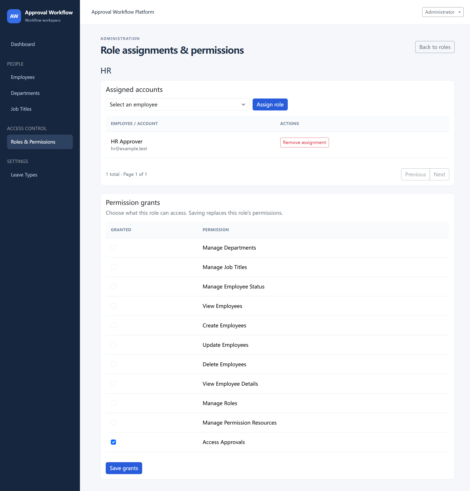
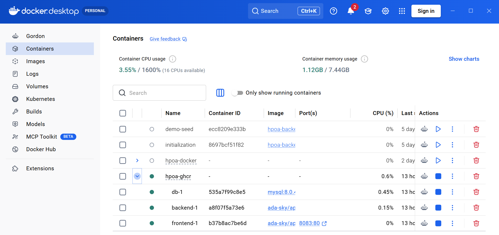
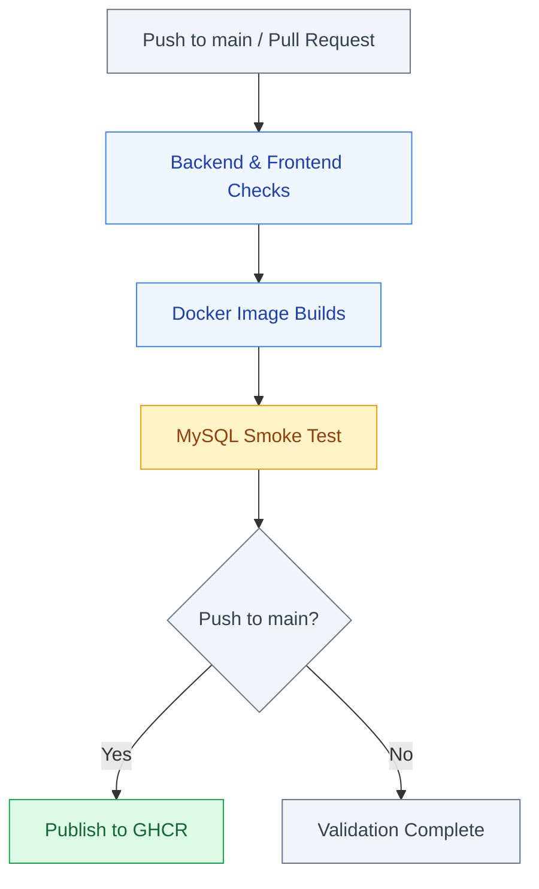
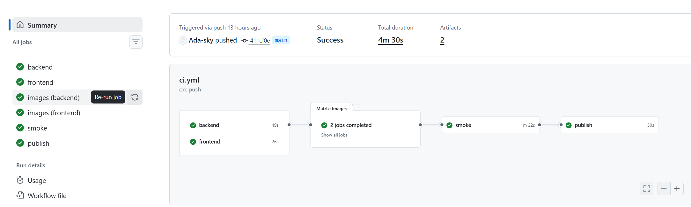
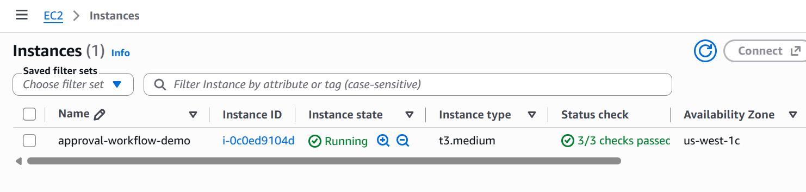
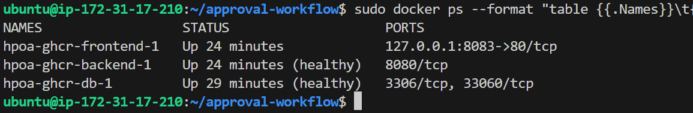

# Approval Workflow Platform

[](https://github.com/Ada-sky/approval-workflow-platform/actions/workflows/ci.yml)

A full-stack employee leave approval platform built with React, Spring Boot, MySQL, and Activiti BPMN. Employees can submit and track leave requests, while managers and HR review and process them through role-based, multi-stage approval workflows. Administrators manage employee accounts, organizational data, and access permissions.

------

## Screenshots

### Dashboard



### Workflow Progress



### Approval Workbench



### Role & Permission Management



### Docker Containers



---

## Key Features

**Employee**

- Submit and track leave requests
- View approval progress and decision history
- Withdraw eligible pending requests and archive completed requests

**Approver (Department Manager / General Manager / HR)**

- Review and approve or reject assigned leave requests
- Manage pending approval tasks
- View personal approval history
- Submit and manage their own leave requests

**Administrator**

- Manage employee records, departments, job titles, and leave types
- Manage roles and access permissions (RBAC)
- Provision employee accounts with securely generated temporary passwords

---

## Approval Workflow

Leave requests follow conditional, multi-stage approval workflows based on the applicant's role and leave duration.

| Applicant                 | Leave Duration | Approval Route                            |
| ------------------------- | -------------- | ----------------------------------------- |
| Employee                  | ≤ 3 days       | Department Manager → HR                   |
| Employee                  | > 3 days       | Department Manager → General Manager → HR |
| Department Manager        | Any duration   | General Manager → HR                      |
| General Manager           | Any duration   | HR                                        |
| HR                        | Any duration   | General Manager                           |
| System-only Administrator | —              | Cannot submit leave                       |

Leave duration is calculated using **inclusive calendar days**. Requests lasting exactly three days do not require General Manager approval.

### Workflow Rules

- **Authorization:** Only eligible approvers can act on assigned tasks, and applicants cannot approve their own requests.
- **Rejection & Withdrawal:** Both terminate the active workflow while preserving request and approval history.
- **Audit History:** Approval decisions remain accessible to authorized users, even after applicants archive completed requests.

---

## Tech Stack

| Area | Technologies |
| --- | --- |
| Backend | Java 21, Spring Boot, Spring Security, Spring Data JPA |
| Frontend | React, JavaScript, Bootstrap |
| Workflow | Activiti 8, BPMN |
| Database | MySQL 8, Flyway |
| Infrastructure | Docker, Docker Compose, nginx, AWS EC2, GHCR |
| CI/CD | GitHub Actions |
| Testing | JUnit 5, Mockito, MockMvc, Vitest, React Testing Library |

------

## Engineering Highlights

- **BPMN Workflow & Conditional Routing:** Implemented multi-stage approval workflows using Activiti BPMN, with approval routes determined by applicant roles and leave duration.
- **Task-Level Authorization & RBAC:** Enforced role-based permissions and task-level authorization using Spring Security, preventing unauthorized approval decisions and self-approval.
- **Transactional Consistency:** Used Spring transactions and pessimistic row locking to coordinate approval and withdrawal operations, reducing the risk of conflicting state changes.
- **Database Persistence & Migrations:** Implemented application persistence with Spring Data JPA and versioned database migrations using Flyway, while Activiti manages its own workflow engine tables.
- **Audit History & Data Integrity:** Preserved approval decisions and request history across rejection, withdrawal, and archiving, with ownership and authorization checks protecting historical records.
- **Authentication & CSRF Protection:** Implemented session-based authentication, BCrypt password hashing, and CSRF protection for state-changing requests.
- **Automated Testing & CI/CD:** Added backend unit and integration tests, frontend tests, and GitHub Actions workflows to validate builds, run smoke tests, and publish versioned container images to GHCR.
- **Containerization & AWS Deployment:** Containerized the React/nginx frontend, Spring Boot backend, and MySQL database using Docker Compose, and successfully deployed and validated the application on AWS EC2.

------

## Architecture

```text
React Frontend
      │
      ▼
Spring Boot REST API
      │
      ├── Spring Data JPA ────┐
      │                       ├── MySQL
      └── Activiti BPMN ──────┘
```

The React frontend communicates with the Spring Boot backend through REST APIs. Spring Data JPA manages application data, while Activiti executes BPMN workflows and manages approval tasks.
Flyway manages application database migrations, while Activiti maintains its own workflow engine tables.

## Project Structure

```
.
├── backend/                  # Spring Boot REST API
│   └── src/
│       ├── main/
│       │   ├── java/         # Controllers, services, security
│       │   └── resources/
│       │       ├── bpmn/     # Activiti workflows
│       │       └── db/       # Flyway migrations
│       └── test/             # Backend tests
├── frontend/
│   └── src/                  # React application
├── .github/
│   ├── workflows/            # GitHub Actions
│   └── ci/                   # CI smoke tests
├── Screenshots/              # Project screenshots
├── docs/
│   └── deployment.md         # Deployment guide
├── compose.yaml              # Local Docker Compose deployment
├── compose.ghcr.yaml         # Deployment using published GHCR images
├── .env.example              # Local environment template
├── .env.ghcr.example         # GHCR deployment environment template
└── README.md
```

------

## Quick Start (Docker)

**Prerequisite:** Docker Desktop or Docker Engine with Docker Compose.

1. Copy `.env.example` to `.env` and set strong `DOCKER_DB_PASSWORD` and `DOCKER_ROOT_PASSWORD` values.
2. Build the images, start MySQL, and initialize a **new** database:

```sh
docker compose build backend frontend
docker compose up -d --wait db
docker compose --profile setup run --rm initialize
```

3. Optionally set `HPOA_DEMO_PASSWORD` (16–72 UTF-8 bytes) in `.env` and create demo users **once**, before modifying demo data:

```sh
docker compose --profile demo run --rm demo-seed
```

4. Start the application:

```sh
docker compose up -d backend frontend
```

Open **http://localhost:8081**. For later starts, run `docker compose up -d db backend frontend`. To stop without deleting the database, run `docker compose down`. **Do not use `docker compose down -v` unless you intend to delete stored data.**

For versioned GHCR images, initialization details, upgrades, troubleshooting, and EC2 access, see the **[Deployment Guide](docs/deployment.md)**.

------

## Testing

Automated tests cover workflow routing, approval decisions, authentication, authorization, business logic, and frontend interactions. The backend unit tests run without a database.

**Backend (JUnit 5, Mockito, MockMvc)**

```sh
mvn -B -ntp -f backend/pom.xml test
mvn -B -ntp -f backend/pom.xml package
```

**Frontend (Vitest, React Testing Library)**

```sh
cd frontend
npm ci
npm test
npm run build
npm run format:check
```

The application was also verified in an isolated Docker environment, including database initialization, session authentication, CSRF protection, and backend readiness.

------

## CI/CD and Container Publishing

GitHub Actions automatically validates the application on pushes to `main` and pull requests targeting `main`. The pipeline runs backend tests and packaging, frontend tests and formatting checks, production builds, and Docker image builds.

### GitHub Actions Pipeline



A disposable MySQL smoke test validates Flyway/Activiti initialization, backend readiness, the CSRF endpoint, and unauthorized API protection. **Any failed check blocks image publishing.**

### Successful CI Run



### Container Publishing

After all checks pass on a push to `main`, the exact CI-tested backend and frontend images are published to GitHub Container Registry (GHCR) using commit-specific `sha-<full-commit-sha>` tags.

Pull requests run validation but do not publish images. **Publishing does not automatically deploy to AWS EC2.**

For detailed deployment instructions, see the [Deployment Guide](docs/deployment.md).

------

## AWS EC2 Deployment

Deployed and validated the application on an **AWS EC2 t3.medium** instance running **Ubuntu 24.04**, using Docker Compose and versioned images from GitHub Container Registry (GHCR).

MySQL 8, Spring Boot, and React/nginx ran in separate containers. Database migrations and the Activiti workflow engine were initialized successfully, and application login was verified through a secure SSH tunnel.

The frontend was bound to the EC2 host's loopback interface, with no publicly exposed backend or database ports. This was a temporary deployment for validation, not a publicly hosted production service.

### EC2 Instance and Health Checks



### Docker Containers Running on EC2



For deployment instructions, see the [Deployment Guide](docs/deployment.md).
